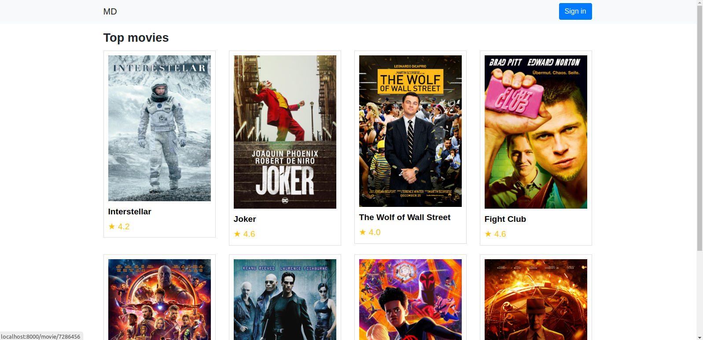
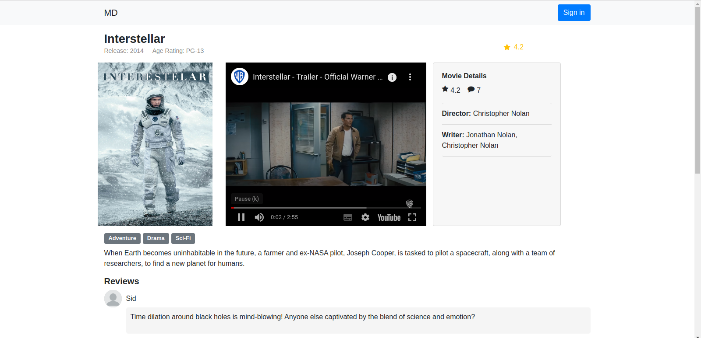
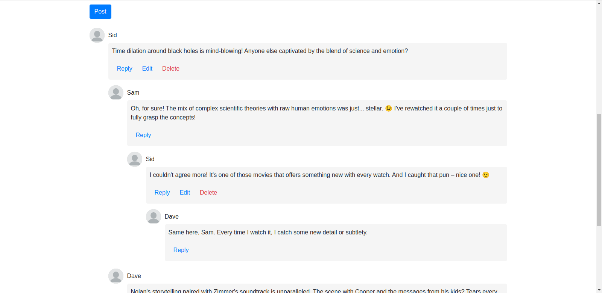

# live-queue-app
Dive deep into discussions, discover perspectives, and share your movie magic moments


## Getting started
To get this project working, first you need to clone this repository.

```bash
git clone <repo-url>
```
Now install the dependencies using [Composer](https://getcomposer.org/).

```bash
composer install
```

Create ```.env``` file from ```.env.example``` and connect it to you database. Now migrate the eloquent models to the database.

```bash
php artisan migrate
```
After that you can run the app using

```bash
php artisan serve
```

You can find the app working in ``localhost:8000``


## Project screenshots



